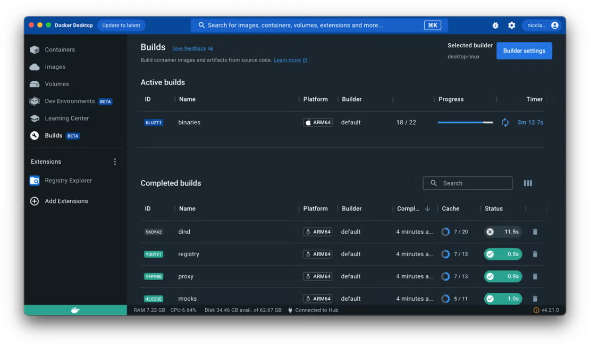
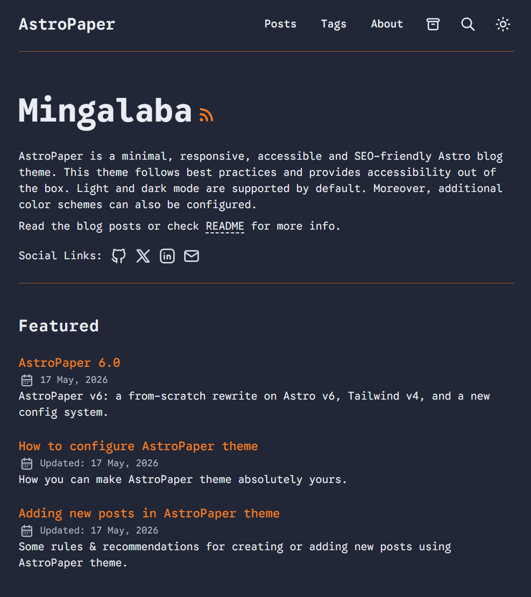

> **TL;DR**: Astro + Docker + GitHub Actions = блог, который сам деплоится на VPS при каждом пуше. Пошаговый гайд для Windows.

---

## Бонус: промпт для ИИ-агента

Не хочешь делать всё руками? Я подготовил [готовый промпт для Claude Code](/posts/astro-blog-prompt/) — отправляешь его агенту и он сам настраивает весь блог за тебя. Один копипаст — и через 5 минут всё работает.

---

## Что такое Astro и зачем оно вообще нужно

**Astro** — это фреймворк для контентных сайтов. Его фишка в том, что он генерирует статический HTML без лишнего JavaScript. Открываешь страницу — она уже готова, никакого ожидания пока что-то загрузится и выполнится. Результат: максимальная скорость, хорошие позиции в поисковиках, счастье.

Чтобы с ним работать, нужно понимать базово: что такое git-репозитории, node/npm, и не бояться IDE и терминала. Но сейчас есть ИИ, так что порог входа реально снизился.

### Альтернативы — если интересно сравнить

**Для контентных сайтов:**
- **Hugo** — очень быстрый, написан на Go, огромная экосистема тем
- **Eleventy (11ty)** — гибкий, минималистичный, без лишнего
- **Jekyll** — старожил, хорошо дружит с GitHub Pages

**Если нужна интерактивность:**
- **Next.js** — React, подходит и для сайтов, и для приложений
- **Nuxt** — то же самое, но на Vue
- **SvelteKit** — на Svelte, очень лёгкий и быстрый

**Если совсем без кода:**
- **Webflow** — визуальный редактор, экспортирует чистый HTML
- **Framer** — популярен для портфолио и лендингов

WordPress никуда не делся, но в 2026-м его рекомендовать сложно — он просто устарел. Если не знаете с чего начать — лучше опишите свою задачу ИИ, он поможет сузить выбор и предложит оптимальное решение под ваш случай.

---

## Выбор темы

Сначала идём сюда: **[astro.build/themes](https://astro.build/themes)**

Там куча готовых шаблонов. Выбираете то, что нравится визуально — это и будет основа вашего блога. Я взял AstroPaper, он минималистичный, быстрый и хорошо настроен под блог.


---

## Windows + Docker = нормально живём

Вот тут начинается моя история. Я на Windows, а запускать Node, Python и всё остальное прямо на ней — это боль. Всё странно работает, библиотеки конфликтуют, полчаса теряешь на настройку окружения вместо того чтобы что-то делать.

Мой выбор: **всё в Docker**. Да, чуть сложнее стартануть — но это окупается. Изолированная среда, нет мусора в системе, легко переносить, Docker Desktop просто висит в фоне и не мешает.

Плюс ИИ отлично пишет Dockerfile и docker-compose — так что реально не так страшно, как кажется.

На **Linux/Mac** всё проще — там Node ставится штатно и всё работает по документации из коробки.

---

## Установка: пошаговый гайд (Windows + Docker)

### Шаг 1. Установи Docker Desktop

Скачай с [docker.com/products/docker-desktop](https://docker.com/products/docker-desktop), установи, перезагрузи компьютер.



---

### Шаг 2. Создай папку проекта

Например: `C:\myblog`

---

### Шаг 3. Открой PowerShell в папке

Зайди в папку в проводнике → зажми `Shift` → правой кнопкой мыши → **«Открыть окно PowerShell здесь»**

---

### Шаг 4. Скачай шаблон через Docker

```powershell
docker run --rm -it -v ${PWD}:/app -w /app node:22-alpine sh -c "npx create-astro@latest . -- --template satnaing/astro-paper"
```

Это запустит Node внутри Docker-контейнера и создаст проект прямо в твоей папке. Задаст несколько вопросов — жми Enter на всё.

> [!note]
> Вместо `satnaing/astro-paper` вставь путь к репозиторию вашей темы — он указан на странице темы на GitHub.

Если папка не пуста (например, уже есть файлы) — укажи подпапку: `./blog`. Git тоже понадобится — установи, если ещё нет.

---

### Шаг 5. Установи зависимости

```powershell
docker run --rm -it -v ${PWD}/blog:/app -w /app node:22-alpine sh -c "npm install"
```

---

### Шаг 6. Структура папок

После всего этого у тебя должно получиться примерно так:

```
myblog/
├── blog/                    ← сам проект Astro
│   ├── src/
│   ├── public/
│   ├── package.json
│   └── ...
├── .github/
│   └── workflows/
│       └── deploy.yml       ← GitHub Actions
└── docker-compose.dev.yml   ← запуск для разработки
```

---

### Шаг 7. Настрой docker-compose для разработки

Создай файл `docker-compose.dev.yml` в корне проекта:

```yml
services:
  blog:
    image: node:22-alpine
    working_dir: /app
    ports:
      - "4321:4321"
    volumes:
      - ./blog:/app
    command: sh -c "npm install && npm run dev -- --host"
```

Теперь запускаешь одной командой:

```powershell
docker compose -f docker-compose.dev.yml up
```

И по адресу **[http://localhost:4321](http://localhost:4321)** будет живой блог. При изменении файлов Astro автоматически обновляется — без перезапуска контейнера.

Приколы Windows по обновлению файлов:

```ts
vite: {
    plugins: [tailwindcss()],
    server: {
      watch: {
        usePolling: true,
        interval: 1000,
      },
    },
```

Добавил `usePolling: true` в Vite server watch config. Это классическая проблема Docker Desktop на Windows — файловые события (inotify) не пробрасываются с хоста в контейнер через volume mount. Vite/Astro не видит изменений и не перезагружает страницу.



---

## Деплой через GitHub Actions

Схема простая: пишешь пост → пушишь в GitHub → GitHub Actions билдит Astro → копирует на сервер → Nginx перезапускается. Всё автоматически.

### Файл деплоя

Создай `.github/workflows/deploy.yml`:

```yml
name: Build & Deploy

on:
  push:
    branches: [main]
  workflow_dispatch:

permissions:
  contents: read

env:
  FORCE_JAVASCRIPT_ACTIONS_TO_NODE24: true

jobs:
  build-deploy:
    runs-on: ubuntu-latest
    steps:
      - uses: actions/checkout@v4

      - uses: actions/setup-node@v4
        with:
          node-version: 22

      - name: Install & Build
        working-directory: ./blog
        run: |
          npm install
          npm run build

      - name: Deploy to VPS
        uses: appleboy/scp-action@v1
        with:
          host: ${{ secrets.SERVER_HOST }}
          username: ${{ secrets.SERVER_USER }}
          key: ${{ secrets.SERVER_SSH_KEY }}
          port: ${{ secrets.SERVER_PORT }}
          source: "blog/dist/"
          target: "~/myblog"
          strip_components: 2

      - name: Reload Nginx
        uses: appleboy/ssh-action@v1
        with:
          host: ${{ secrets.SERVER_HOST }}
          username: ${{ secrets.SERVER_USER }}
          key: ${{ secrets.SERVER_SSH_KEY }}
          port: ${{ secrets.SERVER_PORT }}
          script: |
            cp -r ~/myblog/. /var/www/myblog/
            nginx -s reload
```

---

### Как добавить секреты в репозиторий

GitHub Actions использует переменные через **Secrets** — они хранятся зашифрованно и не попадают в код.

1. Открой репозиторий на GitHub
2. Перейди в **Settings → Secrets and variables → Actions**
3. Нажми **«New repository secret»**
4. Добавь по одному:

| Имя | Что вписывать |
|-----|---------------|
| `SERVER_HOST` | IP-адрес или домен сервера |
| `SERVER_USER` | Имя пользователя SSH |
| `SERVER_SSH_KEY` | Приватный SSH-ключ (содержимое файла `id_rsa`) |
| `SERVER_PORT` | Порт SSH (обычно `22`) |

После этого — каждый `git push` в `main` запускает деплой автоматически.

---

## Поисковики: как ускорить индексацию

Сайт готов, работает — но Google пока о нём не знает. Чтобы ускорить индексацию:

### Google Search Console

1. Зайди на [search.google.com/search-console](https://search.google.com/search-console)
2. Добавь свой домен (потребует подтверждение через DNS-запись или HTML-файл)
3. После подтверждения — отправь **Sitemap**: обычно это `https://вашсайт.com/sitemap.xml` (Astro генерирует его автоматически при правильной конфигурации)
4. В разделе **«Проверка URL»** можно вручную запросить индексацию конкретных страниц

Результаты появляются не мгновенно — от нескольких дней до пары недель. Но без Search Console это может занять и месяцы.


---

## Итого

Схема, которая у меня работает:

```
Пишу пост в IDE
      ↓
git push в GitHub
      ↓
GitHub Actions билдит Astro
      ↓
Копирует dist/ на VPS
      ↓
Nginx раздаёт статику
      ↓
Profit
```

Тема настраивается отдельно под каждый шаблон — там обычно всё понятно из документации. Я у себя поменял цветовую схему, шрифты, собираюсь добавить сайдбар. Но главное — это под моим полным контролем, современное и работает именно так, как мне нужно.

Вах Вах!