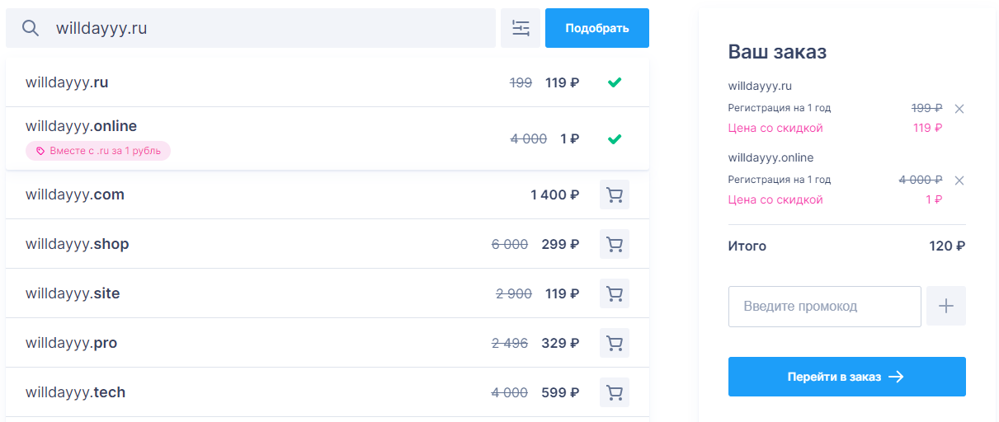

> **TL;DR** Домен → купи нормальную зону (`.com`, `.io`, `.blog`), смени NS на Cloudflare, в Cloudflare добавь A-запись на свой сервер, поставь Nginx, настрой SSL через Cloudflare Origin CA, закрой боты через `user_agent` фильтр и security headers. Порты 80 и 443 — только Nginx, ничего другого.

---

## 1. Регистрация домена

Первое, с чего начинается жизнь домена — это где его зарегистрировать.

Регистраторов много, вот несколько известных:

| Регистратор | Особенности |
|------------|-------------|
| **Namecheap** | Дешёвые зоны, удобный интерфейс, популярен у разработчиков |
| **GoDaddy** | Самый крупный в мире, но агрессивный маркетинг и upsell |
| **Reg.ru** | Популярен в СНГ, поддержка на русском |
| **Porkbun** | Низкие цены, честный renewal, хороший UI |
| **Cloudflare Registrar** | Продаёт домены по себестоимости, без наценки |

Какой использую я — не скажу в целях безопасности 😄



это пример так в целом выглядит у всех.

### Какую зону выбрать?

У меня домен **neuronavt** — и регистратор сразу предлагает кучу зон на выбор. Тут в основном дело вкуса, но есть нюанс: некоторые дешёвые зоны облюбовали спамеры и фишеры, из-за чего они уже изначально в чёрных списках у почтовиков и браузеров.

**Нормальные зоны** — проверенные, с хорошей репутацией:

`.com` `.net` `.org` `.io` `.dev` `.app` `.blog` `.tech`

**Стрёмные зоны** — дешёвые, но часто попадают в спам-фильтры:

`.xyz` `.top` `.click` `.loan` `.gq` `.cf` `.tk` `.ml`

Вывод простой: лучше чуть переплатить за нормальную зону, чем потом объяснять почтовым серверам, что ты не спамер.

---

## 2. DNS: настройка через Cloudflare

Дальше уже поинтереснее — настройка DNS. Я настраиваю через **Cloudflare**, потому что там масса полезных функций бесплатно: проксирование трафика, защита от DDoS, аналитика, кэширование, правила фаервола.

**Альтернативы Cloudflare:**

- **Bunny DNS** — очень быстрый, простой, дешёвый платный тариф
- **NS1** — мощный, гибкий, больше для энтерпрайза
- **AWS Route 53** — удобно, если уже сидишь на AWS
- **Hetzner DNS** — бесплатный, если сервер на Hetzner, всё в одном месте

Но если начинаешь с нуля — Cloudflare это очевидный выбор.


### Как подключить домен к Cloudflare

В регистраторе нужно поменять **Name Servers** (NS-записи) на серверы Cloudflare:

```
lena.ns.cloudflare.com
mark.ns.cloudflare.com
```

> [!note]
> Конкретные NS тебе покажет сам Cloudflare при добавлении домена. После смены NS может пройти от нескольких минут до 48 часов на обновление — обычно быстрее.

После этого заходим в Cloudflare, добавляем домен — он сам просканирует существующие DNS-записи и предложит их подтянуть. Дальше уже управляем DNS оттуда.

---

## 3. Хостинг или свой сервер?

Есть несколько вариантов в нет свой сайт выложить, но я расскажу о хостинге и VPS

### Хостинг (shared/VPS у провайдера)

Если берёшь хостинг — всё намного проще. Провайдер (например, Beget, TimeWeb, REG.ru, DigitalOcean, Hetzner) даёт тебе IP и панель управления. В Cloudflare нужно только добавить **A-запись**, которая указывает на этот IP:

```
A   neuronavt.blog   185.xxx.xxx.xxx   Proxied ✅
```

Галочка «Proxied» (оранжевое облачко) означает, что трафик идёт через Cloudflare — это и защита, и кэш.

**Плюсы хостинга:** не надо думать об обновлениях ОС, nginx, сертификатах — всё за тебя уже сделали.
**Минусы:** меньше контроля, соседи по серверу могут влиять на производительность, потолок по кастомизации.

### Свой сервер (VPS/Dedicated)

**Плюсы:** полный контроль, можно крутить что угодно, лучше соотношение цена/мощность при нагрузке.
**Минусы:** надо самому следить за безопасностью, обновлениями, настройкой.


---

## 4. Веб-сервер: Nginx, Apache или Caddy?

На своём сервере нужен веб-сервер. Три основных варианта:

| | **Nginx** | **Apache** | **Caddy** |
|---|---|---|---|
| **Производительность** | Отлично на статике и высоких нагрузках | Чуть тяжелее под нагрузкой | Хорошая |
| **Конфигурация** | Декларативная, понятная | `.htaccess` — гибко, но сложно | Максимально простая |
| **HTTPS / SSL** | Вручную или certbot | Вручную или certbot | **Автоматически из коробки** |
| **Сложность** | Средняя | Средняя | Низкая |
| **Ресурсы** | Минимальные | Побольше | Минимальные |
| **Когда выбирать** | Продакшн, высокие нагрузки, полный контроль | Легаси-проекты, .htaccess нужен | Быстрый старт, автосертификаты |

Я взял **Nginx** — но наверно caddy бы взял, в следующий раз, просто как-то чаще слышал про nginx.


---

## 5. Конфигурация Nginx

Установка на Ubuntu/Debian:

```bash
sudo apt update && sudo apt install nginx -y
```

```bash
sudo nano /etc/nginx/site-available/neuronavt
```

Вот моя конфигурация для neuronavt.blog — с комментариями что и зачем:

```nginx file=neuronavt
# Блок 1: HTTP → HTTPS редирект
# Весь трафик на 80 порту сразу перебрасываем на HTTPS
server {
    listen 80;
    server_name neuronavt.blog www.neuronavt.blog;

    return 301 https://$host$request_uri;
}

# Блок 2: Основной HTTPS-сервер
server {
    listen 443 ssl http2;
    server_name neuronavt.blog www.neuronavt.blog;

    # --- SSL ---
    # Используем Cloudflare Origin CA сертификат
    # Это не Let's Encrypt — это сертификат специально для связки
    # "Cloudflare ↔ твой сервер", браузер его не увидит напрямую
    ssl_certificate     /etc/nginx/ssl/neuronavt-fullchain.pem;
    ssl_certificate_key /etc/nginx/ssl/neuronavt-privkey.pem;

    ssl_protocols TLSv1.2 TLSv1.3;       # Только современные протоколы
    ssl_ciphers HIGH:!aNULL:!MD5;         # Слабые шифры — запрещены
    ssl_prefer_server_ciphers off;

    # --- Cloudflare Real IP ---
    # Без этого в логах будут IP-адреса Cloudflare, а не реальных пользователей
    # Nginx будет доверять этим диапазонам и брать настоящий IP из заголовка CF-Connecting-IP
    real_ip_header CF-Connecting-IP;
    set_real_ip_from 173.245.48.0/20;
    set_real_ip_from 103.21.244.0/22;
    set_real_ip_from 103.22.200.0/22;
    set_real_ip_from 103.31.4.0/22;
    set_real_ip_from 141.101.64.0/18;
    set_real_ip_from 108.162.192.0/18;
    set_real_ip_from 190.93.240.0/20;
    set_real_ip_from 188.114.96.0/20;
    set_real_ip_from 197.234.240.0/22;
    set_real_ip_from 198.41.128.0/17;
    set_real_ip_from 162.158.0.0/15;
    set_real_ip_from 104.16.0.0/13;
    set_real_ip_from 172.64.0.0/13;
    set_real_ip_from 131.0.72.0/22;

    # --- Отсекаем мусорных ботов ---
    # masscan, nmap, zgrab — это сканеры, которые ищут уязвимости
    # python-requests, curl без реферера — часто скрейперы и боты
    # 444 — это nginx-специфичный код: соединение обрывается без ответа
    # т.е. бот не получает даже 403, просто тишина
    if ($http_user_agent ~* "(libredtail|masscan|nmap|zgrab|python-requests|curl|bot|scanner|malware)") {
        return 444;
    }

    # --- Security Headers ---
    # X-Frame-Options: запрещаем вставлять сайт в iframe (защита от clickjacking)
    # X-XSS-Protection: включаем XSS-фильтр браузера (легаси, но не мешает)
    # X-Content-Type-Options: запрещаем браузеру угадывать MIME-тип
    # Referrer-Policy: при переходах на другие сайты — только origin, без полного URL
    # Content-Security-Policy: белый список источников скриптов, стилей, картинок
    add_header X-Frame-Options "SAMEORIGIN" always;
    add_header X-XSS-Protection "1; mode=block" always;
    add_header X-Content-Type-Options "nosniff" always;
    add_header Referrer-Policy "strict-origin-when-cross-origin" always;
    add_header Content-Security-Policy "default-src 'self'; script-src 'self' 'unsafe-inline'; style-src 'self' 'unsafe-inline'; img-src 'self' data:; font-src 'self';" always;

    # --- Корень сайта ---
    root /var/www/neuronavt.blog;
    index index.html;

    location / {
        # Сначала ищем файл, потом директорию, потом index.html (для SPA)
        # Если ничего не нашли — 404
        try_files $uri $uri/ /index.html =404;
    }

    # --- Запрет на скрытые файлы ---
    # .env, .git, .htaccess и т.д. — не должны быть доступны снаружи
    location ~ /\. {
        deny all;
        access_log off;
        log_not_found off;
    }
}
```

После добавления конфига — проверяем и перезапускаем:

### 1. Команда:
```bash
ln -s /etc/nginx/sites-available/neuronavt /etc/nginx/sites-enabled/
```

Что она делает?

- Создаёт символическую ссылку (shortcut) на конфигурационный файл.
- Nginx смотрит только в папку `/etc/nginx/sites-enabled/` — именно оттуда он берёт активные сайты.
- Папка `/etc/nginx/sites-available/` — это просто "хранилище" всех конфигов. Чтобы сайт заработал, нужно создать ссылку в sites-enabled.

Простыми словами:  
Эта команда активирует конфигурацию твоего домена neuronavt.

Без этой команды Nginx будет игнорировать файл, даже если он правильно написан.

### 2. Команда:

```bash
nginx -t
```

Что она делает?

- Тестирует (проверяет) все конфигурационные файлы Nginx на ошибки.
- Проверяет синтаксис, правильность путей, опечатки и т.д.
- Очень важная команда! Никогда не перезагружай Nginx без неё.

Что ты увидишь в ответе:

- ✅ syntax is ok
- ✅ test is successful — всё хорошо, можно применять.

- Или увидишь ошибки с указанием строки и файла, где проблема.

### Правильная последовательность после изменения конфигов:

```bash
sudo nginx -t                    # сначала проверяем
sudo systemctl reload nginx      # потом применяем изменения
```

Или одной строкой:

```bash
sudo nginx -t && sudo systemctl reload nginx
```

### Настройка сертификатов

это вот про эти строки:

```nginx
ssl_certificate     /etc/nginx/ssl/neuronavt-fullchain.pem;
ssl_certificate_key /etc/nginx/ssl/neuronavt-privkey.pem;
```

Эти строки указывают на SSL-сертификаты, которых у тебя пока нет.  

Поскольку домен стоит за Cloudflare, есть несколько вариантов. Самый простой и правильный для тебя — **Cloudflare Origin CA**.

1. **Создай папку для сертификатов**
```bash
sudo mkdir -p /etc/nginx/ssl
sudo chmod 700 /etc/nginx/ssl
```

2. **Получи Origin Certificate от Cloudflare**

   - Зайди в Cloudflare → выбери свой домен  
   - Перейди в **SSL/TLS → Origin Server**  
   - Нажми **Create Certificate**  
   - Выбери:
     - Hostnames: укажи нужный домен (по умолчанию будут указанны)
     - Expiration: 15 лет (максимум)
   - Нажми **Create**
   - Скопируй **Private Key** и сохрани в файл:
     ```bash
     sudo nano /etc/nginx/ssl/neuronavt-privkey.pem
     ```
   - Скопируй **Certificate** (весь текст сверху вниз) и сохрани:
     ```bash
     sudo nano /etc/nginx/ssl/neuronavt-fullchain.pem
     ```

3. Установи правильные права:

```bash
sudo chmod 600 /etc/nginx/ssl/neuronavt-privkey.pem
sudo chmod 644 /etc/nginx/ssl/neuronavt-fullchain.pem
```

---

## 6. Важный момент про порты

Главное — порты **80** и **443** должны быть заняты **только** Nginx. Если на том же сервере стоит, например, **VLESS/Reality (Xray)** и ты пытаешься повесить его на 443 — ничего не выйдет, порт уже занят.

В таком случае варианты такие:

- Вынести прокси на другой порт (например, 8443) и настроить проброс через Nginx
- Использовать отдельный сервер/VPS для сайта и для прокси
- Поднять Xray с `fallback` на Nginx — тогда Xray сидит на 443, а нераспознанный трафик отдаёт Nginx. Сложнее, но возможно

Проверить, кто сидит на порту:

```bash
sudo ss -tlnp | grep -E ':(80|443)'
```

---

## Итог

Вся цепочка выглядит так:

```
Браузер пользователя
       ↓
Cloudflare (проксирование, DDoS-защита, кэш)
       ↓
Nginx на сервере (SSL, заголовки безопасности, фильтр ботов)
       ↓
Файлы сайта /var/www/neuronavt.blog
```

Звучит страшно, но на практике один раз настроил — и работает само. Главное — не торопиться и понимать зачем каждый шаг, тогда и дебажить проще.
