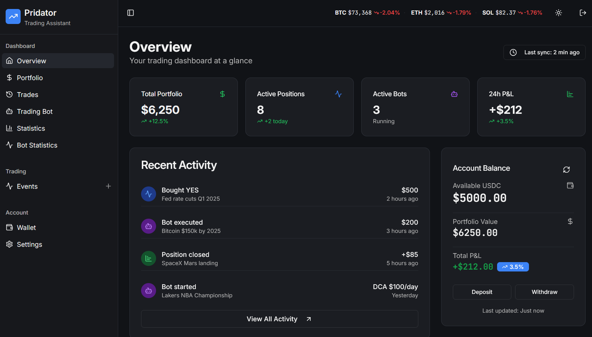
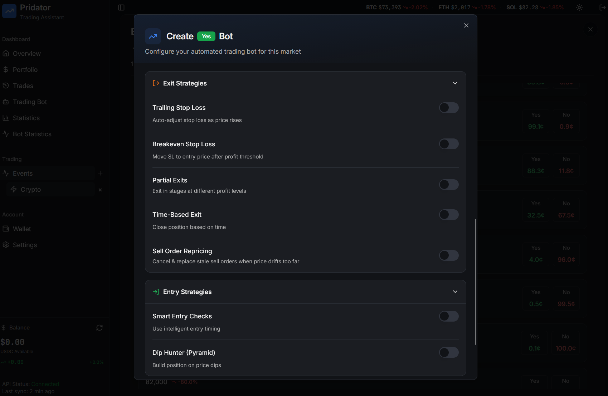
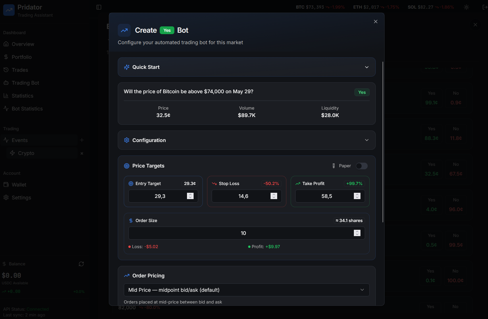
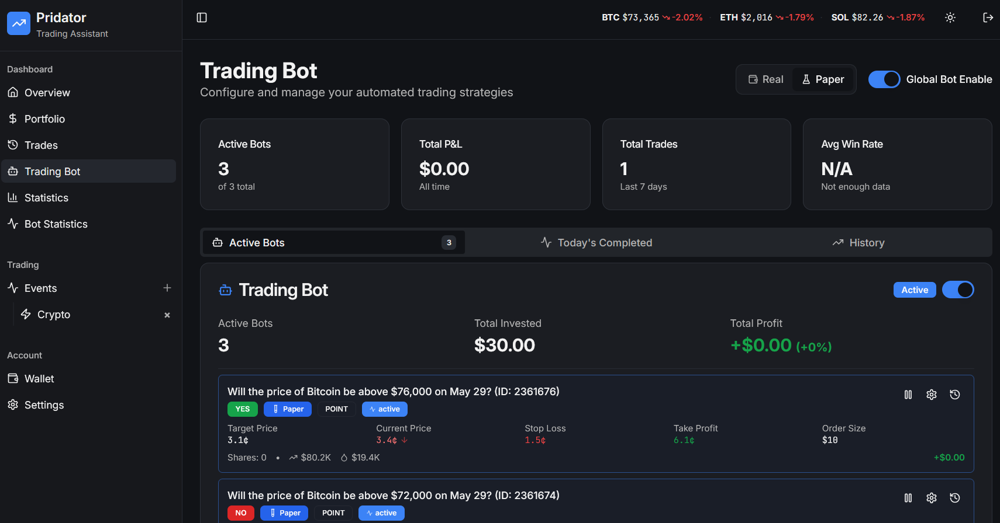

> **TL;DR**: Обзорная статья моего проекта: PRIDATOR — платформа для автоматической торговли на Polymarket. Настраиваешь бота с нужной стратегией, задаёшь риск-параметры — и система торгует 24/7. Модульная архитектура (вход/выход), AES-256 шифрование кошельков, WebSocket real-time, PostgreSQL на Neon.

---

## Что такое PRIDATOR

PRIDATOR — это веб-платформа для автоматизированной торговли на предсказательных рынках Polymarket. Она позволяет запускать торговых ботов с разными стратегиями, управлять рисками и отслеживать позиции в реальном времени — всё через единый интерфейс.

Если коротко: вы настраиваете бота, выбираете маркет и стратегию, задаёте параметры риска — и система торгует за вас 24/7. + прикручу иишку



## Зачем это нужно

Предсказательные рынки — это площадки, где люди делают ставки на исход реальных событий: выборы, спортивные матчи, экономические показатели. Polymarket — крупнейшая из таких платформ, работающая на блокчейне Polygon.

Проблема ручной торговли на предсказательных рынках:

- Нужно постоянно мониторить десятки маркетов
- Эмоции мешают принимать рациональные решения
- Невозможно реагировать на изменения цен 24/7
- Сложно системно управлять рисками

PRIDATOR решает эти проблемы через автоматизацию. Боты работают по заданным правилам, не устают и не поддаются эмоциям.

## Как устроена платформа

Архитектура PRIDATOR состоит из трёх основных слоёв:

**Frontend** — React 18 с TypeScript. Современный интерфейс на базе shadcn/ui с тёмной и светлой темой, графиками Recharts и анимациями Framer Motion. Все данные обновляются в реальном времени через WebSocket.

**Backend** — Express.js сервер с TypeScript. Здесь живёт движок ботов, сервис ордеров, менеджер WebSocket-соединений и координатор цен. Сервер общается с Polymarket через четыре API: CLOB (ордера), Data (маркеты), Gamma (аналитика) и Real-time (live данные).

**База данных** — PostgreSQL на Neon с Drizzle ORM. 11 таблиц хранят всё: от зашифрованных кошельков до логов каждого цикла торговли.

```text
┌─────────────────────────────────────────────────────────────────┐
│                         CLIENT (React)                          │
│  ┌──────────────┐  ┌───────────────┐  ┌───────────────────────┐ │
│  │  Dashboard   │  │  Market Pages │  │  Trading Bot Pages     │ │
│  │  Portfolio   │  │  Events/Cats  │  │  Settings/Admin        │ │
│  └──────────────┘  └───────────────┘  └───────────────────────┘ │
│                          WebSocket Context                      │
└─────────────────────────────────────────────────────────────────┘
                              ▲
                    HTTP / WebSocket
                              ▼
┌─────────────────────────────────────────────────────────────────┐
│                    SERVER (Express.js)                          │
│  ┌──────────────┐  ┌───────────────┐  ┌───────────────────────┐ │
│  │  Auth Routes │  │  Bot Engine   │  │  WebSocket Manager    │ │
│  │  Wallet API  │  │  Order Service│  │  Price Coordinator    │ │
│  └──────────────┘  └───────────────┘  └───────────────────────┘ │
│                              │                                  │
│  ┌────────────────────────────────────────────────────────────┐ │
│  │                    POLYMARKET API LAYER                    │ │
│  │  CLOB Client  │  Data Client  │  Real-time Client  │ WS  │ │
│  └────────────────────────────────────────────────────────────┘ │
└─────────────────────────────────────────────────────────────────┘
                              │
              ┌──────────────┴──────────────┐
              ▼                              ▼
┌─────────────────────────┐    ┌─────────────────────────────┐
│    PostgreSQL (Neon)    │    │       Polygon Network        │
│  - Users, Wallets       │    │    (ethers.js integration)  │
│  - Bots, Positions      │    │    - Place orders           │
│  - Orders, Trades       │    │    - Sign transactions       │
└─────────────────────────┘    └─────────────────────────────┘
```

## Торговые стратегии

В PRIDATOR реализованы три типа ботов, каждый под свой стиль торговли.

### Point Strategy — основная стратегия

Самая продвинутая стратегия с модульной архитектурой. Состоит из модулей входа и выхода, которые можно комбинировать.

**Модули входа:**

- **Smart Entry** — ждёт стабилизации цены, проверяет ликвидность, избегает торговли во время новостей
- **Dip Hunter** — покупает при просадке цены (progressive или aggressive режим)
- **Simple Limit** — лимитный ордер по целевой цене
- **Market** — мгновенный рыночный ордер

**Модули выхода:**

- **Partial Exit Manager** — пошаговый выход по уровням (например, 25% при +10%, ещё 25% при +20%)
- **Breakeven Manager** — переносит стоп-лосс в безубыток после достижения прибыли
- **Time-Based Exit** — автоматическое закрытие за N часов до события
- **Sell Reprint** — пересоздаёт sell-ордер при изменении рыночной цены



## Управление рисками

Торговля без управления рисками — это казино. В PRIDATOR встроено несколько уровней защиты:

| Механизм | Что делает |
|----------|-----------|
| Stop Loss | Закрывает позицию при достижении максимального убытка |
| Take Profit | Фиксирует прибыль при достижении цели |
| Breakeven SL | Переносит стоп-лосс в безубыток после роста |
| Partial Exits | Пошаговый выход — снижает риск, сохраняя потенциал |
| Time-Based Exit | Закрытие за N часов до события (избегает резких движений) |
| Price Staleness | Отклоняет сигнал, если цена устарела более чем на X% |
| Balance Monitoring | Защита баланса кошелька от полного истощения |

### Защита от технических ошибок

Отдельный слой защиты от программных сбоев:

- **Idempotency Keys** — защита от дублирующих ордеров при повторных запросах
- **Optimistic Locking** — предотвращение race conditions при обновлении позиций
- **Atomic Batch Orders** — все ордера в группе создаются или отменяются целиком
- **Stuck Order Cleanup** — автоматическая очистка зависших ордеров каждую минуту



## Безопасность

Платформа работает с реальными деньгами и приватными ключами, поэтому безопасность — приоритет.

**Шифрование кошельков** — приватные ключи шифруются AES-256-GCM (тот же стандарт, что используют банки и военные). Ключи деривируются через PBKDF2. В базе данных никогда не хранится открытый текст.

**Аутентификация** — два варианта входа: классический (email + пароль с bcrypt) и Web3 через Sign-In with Ethereum (SIWE). Сессии хранятся в HTTP-only cookies с CSRF-защитой.

**Защита API** — rate limiting на все эндпоинты, Zod-валидация входных данных, параметризованные SQL-запросы, маскирование чувствительных данных в логах.

## Интерфейс

Платформа предоставляет полноценный веб-интерфейс с real-time обновлениями:

- **Dashboard** — обзор портфеля, активные боты, общий P&L
- **Events** — иерархическая навигация по категориям и маркетам Polymarket
- **Portfolio** — все позиции с realized/unrealized P&L
- **Bot Details** — графики, логи активности, статистика каждого бота
- **Trades** — полная история сделок с tx hash
- **Wallet** — управление кошельками, балансы POL и USDC

Все данные обновляются через WebSocket: цены, статусы ботов, исполнение ордеров. При потере соединения — автоматическое переподключение с exponential backoff.



## Технический стек

| Слой | Технологии |
|------|-----------|
| Frontend | React 18, TypeScript, Tailwind CSS, shadcn/ui, TanStack Query, Recharts |
| Backend | Express.js, TypeScript, WebSocket (ws), ethers.js, Zod, Passport |
| Database | PostgreSQL (Neon), Drizzle ORM |
| Blockchain | Polygon Network, @polymarket/clob-client |
| Build | Vite, esbuild, TSX |

## Что дальше

В планах развития:

- ИИ - аналитика, авто ставки, ассистент.
- Расширенные графики с техническими индикаторами
- Оптимизация портфеля — алгоритмы распределения капитала
- Social Trading — возможность делиться стратегиями
- Мобильное приложение на React Native
- Поддержка других предсказательных рынков
- Маркетплейс стратегий

---

PRIDATOR — это инструмент который разрабатывал изночально я для себя и он вылился вот в такой проект, нужно многое еще доделать, но в целом очень даже удобно получилось, если будут у вас идеи или преложение пишите мне в дерект моего канала в [телеге](https://t.me/ai_ozy) . 